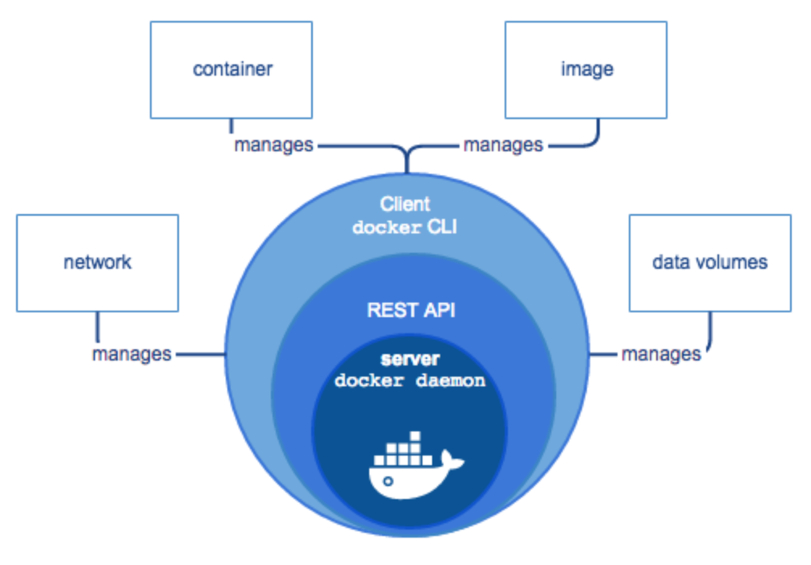
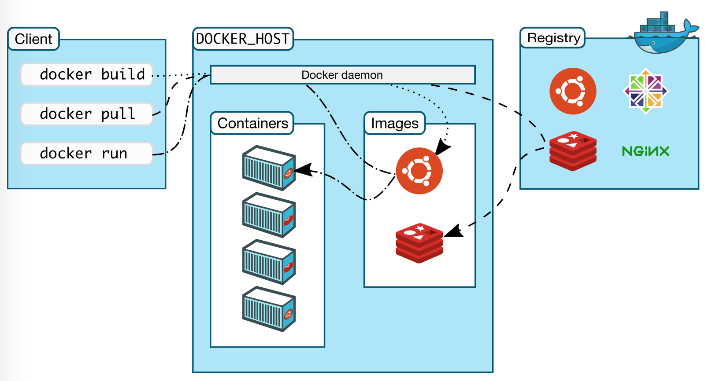

Docker는 Container를 구동시킬 수 있는 환경만 구성되어 있다면, Application들을 한번의 Build로 어디서든 구동 시킬 수 있다. Java application이 JVM위에서 실행되는 모습과 크게 다르지 않아 보인다. Java Application도 JVM만 설치되어 있다면, 어디서든 실행된다. Python Application도 동일하다. 이 모든 것은 똑같고 단지 실행되는 주체(Container, JAR, py)만 다른것일까?

### Client-Server Model

Docker는 **서비스 요청자(Docker Client)와 제공자(Docker Server)** 의 작업이 분리되어 동작하는 Client-Server Model로 되어 있으며 Docker Client는 **REST API** 를 사용하여 Docker Server를 제어한다.

* Docker Client: `docker CLI`
* Docker Server: `docker daemon`
* Docker REST Application

그리고, Docker Server(`docker daemon`)는 Docker Client로 부터 받은 요청에 따라 다음 Docker Object들을 생성하고 관리한다.

* image
* container
* Network
* Data Volumes

[출처 : Docker Docs](https://docs.docker.com/engine/docker-overview/#docker-engine)

### 좀더 자세히

Docker Client는 Docker Daemon과 UNIX socket 또는 REST API를 사용하여 통신을 하며, Docker Daemon이 Container를 구축, 실행 및 배포할 수 있도록 한다. Docker Client와 Daemon은 동일한 시스템에서 실행될 수도 있고, Docker Client를 원격으로 Docker Daemon에 연결하여 사용할 수도 있다.

[출처 : Docker Docs](https://docs.docker.com/engine/docker-overview/#docker-engine)

### Docker daemon

Docker Daemon(`dockerd`)은 Client로 부터 API 요청을 수신하고 Image, Container, network 및 Volume과 같은 Docker Object를 관리한다. Daemon은 Docker 서비스를 관리하기 위해 다른 Daemon과 통신 할 수 있다.

### Docker client

Docker Client(`docker`)는 사용자가 Docker Daemon과 통신하는 주요 방법이다. `docker run`과 같은 명령을 사용하면 Docker Client는 해당 명령을 Docker Daemon으로 전송하여 명령을 수행하게 된다. `docker`명령은 Docker API를 사용하며, Docker Client는 둘 이상의 Docker Daemon과 통신 할 수 있다.

### Docker Registry

Docker Registry는 Docker Image를 저장한다. Docker Hub는 누구나 사용할 수 있는 Public Registry이며, Docker는 기본적으로 Docker Hub에서 Image를 찾아 Container를 구성하도록 되어 있다. 예를들어, `docker pull`을 사용하여 image를 Registry에서 local로 내려받을 수 있으며, `docker push`를 통해 local 의 image를 registry에 저장할 수도 있다. Docker registry는 개개인이 구성할 수도 있고 Docker의 Enterprise Edition에서 제공되는 Docker Trusted Registry이 포함된 Docker Datacenter를 사용할 수도 있다.

### Docker Object

Docker Object는 Docker Daemon에 의해 싱성 및 관리되는 Image / Container / Network / Volume등의 개체를 말한다.

#### image

Image는 Docker Container를 생성하기 위한 읽기 전용 Template이다. Image들은 다른 Image 기반 위에 Customizing이 추가되어 만들 수 있고 이렇게 만들어진 Image는 Docker Registry에 push한 뒤 사용할 수 있다. Image는 Dockerfile에 Image를 만들고 실행하는 데 필요한 단계를 명령어로 정의하여 생성한다. Dockerfile에 정의된 각각의 명령어들은 Image의 Layer를 생성하며, 이러한 layer들이 모여 Image를 구성한다. Dockerfile을 변경하고 Image를 다시 구성하면 변경된 부분만 새로운 layer로 생성된다. 이러한 Image의 Layer구조는 Docker가 타 가상화 방식과 비교할 때 매우 빠르게 기동할 수 있는 요인이 된다.

#### container

Container는 Docker API 사용하여 생성, 시작, 중지, 이동 또는 삭제 할 수 있는 Image의 실행가능한 Instance를 나타낸다. Container를 하나 이상의 network에 연결하거나, 저장 장치로 묶을 수 있고 현재 상태를 바탕으로 새로운 Image를 생성할 수 도 있다 기본적으로 Container는 Host 또는 다른 Container로부터 격리되어 있으며, Network / Storage와 다른 하위시스템에 대한 접근을 직접 제어 할 수 있다. Container는 생성되거나 시작될 때 구성 옵션 및 image로부터 정의된다. Container가 제거 될 때는 영구 저장소에 저장되지 않은 변경 사항은 모두 해당 Container와 같이 사라진다.

#### Service

Service를 사용하면, 여러 개의 Docker Daemon들로 이루어진 영역 내에서 Container들을 확장 시킬 수 있다. Service는 '특정 시간동안 사용 가능한 Service의 Replica 개수'와 같은 상태 정보들을 직접 정의하여 사용할 수 있다. 기본적으로 Service는 Docker Daemon들 간의 load Balancing을 제공하고 있기 때문에 사용자 관점에서는 단일 Application으로 보인다.

### Container를 기동시키자

1. 먼저, `docker search [OPTIONS] TERM`으로 Docker Store와 Hub로 부터 Image를 찾는다.

  ~~~
  {18-07-05 15:12}jaejin-ui-MacBook-Pro:~/dev/Docker@master✗✗✗✗✗✗ jaejin% docker search ubuntu
  NAME                                                      DESCRIPTION                                     STARS               OFFICIAL            AUTOMATED
  ubuntu                                                    Ubuntu is a Debian-based Linux operating sys…   7917                [OK]
  dorowu/ubuntu-desktop-lxde-vnc                            Ubuntu with openssh-server and NoVNC            193                                     [OK]
  rastasheep/ubuntu-sshd                                    Dockerized SSH service, built on top of offi…   156                                     [OK]
  ansible/ubuntu14.04-ansible                               Ubuntu 14.04 LTS with ansible                   93                                      [OK]
  ubuntu-upstart                                            Upstart is an event-based replacement for th…   87                  [OK]
  neurodebian                                               NeuroDebian provides neuroscience research s…   50                  [OK]
  ubuntu-debootstrap                                        debootstrap --variant=minbase --components=m…   38                  [OK]
  1and1internet/ubuntu-16-nginx-php-phpmyadmin-mysql-5      ubuntu-16-nginx-php-phpmyadmin-mysql-5          36                                      [OK]
  nuagebec/ubuntu                                           Simple always updated Ubuntu docker images w…   23                                      [OK]
  tutum/ubuntu                                              Simple Ubuntu docker images with SSH access     18
  i386/ubuntu                                               Ubuntu is a Debian-based Linux operating sys…   13
  ppc64le/ubuntu                                            Ubuntu is a Debian-based Linux operating sys…   12
  1and1internet/ubuntu-16-apache-php-7.0                    ubuntu-16-apache-php-7.0                        10                                      [OK]
  1and1internet/ubuntu-16-nginx-php-phpmyadmin-mariadb-10   ubuntu-16-nginx-php-phpmyadmin-mariadb-10       6                                       [OK]
  eclipse/ubuntu_jdk8                                       Ubuntu, JDK8, Maven 3, git, curl, nmap, mc, …   6                                       [OK]
  codenvy/ubuntu_jdk8                                       Ubuntu, JDK8, Maven 3, git, curl, nmap, mc, …   4                                       [OK]
  darksheer/ubuntu                                          Base Ubuntu Image -- Updated hourly             4                                       [OK]
  1and1internet/ubuntu-16-apache                            ubuntu-16-apache                                3                                       [OK]
  1and1internet/ubuntu-16-nginx-php-5.6-wordpress-4         ubuntu-16-nginx-php-5.6-wordpress-4             3                                       [OK]
  1and1internet/ubuntu-16-sshd                              ubuntu-16-sshd                                  1                                       [OK]
  pivotaldata/ubuntu                                        A quick freshening-up of the base Ubuntu doc…   1
  1and1internet/ubuntu-16-healthcheck                       ubuntu-16-healthcheck                           0                                       [OK]
  pivotaldata/ubuntu-gpdb-dev                               Ubuntu images for GPDB development              0
  smartentry/ubuntu                                         ubuntu with smartentry                          0                                       [OK]
  ~~~

  **Docker Hub** 에는 Community Version의 Image들이 포함되어 있다. 누구나 새로운 Image를 Docker Hub에 push할 수 있지만 해당 Image들의 품질이나 호환성을 Docker가 보장하지 않는다. 대신 **Docker Store** 에는 공인된 업체를 통해 승인된 Image들이 포함되어 있다. 이러한 Image들은 Vendor들에 의해 직접 게시되고 유지/관리 된다. 또한 docker Certified 로고는 Image에 대한 품질, 출처 및 지원에 대한 보증을 제공한다. 공식 Image는 `OFFCIAL`로, 그 외의 Community Image는 `AUTOMATED`에 분류된다.

2. Container로 구성할 image를 Docker Store 및 Hub로 부터 `docker pull [OPTIONS] NAME[:TAG|@DIGEST]`를 이용하여 Pull 받는다.

  ~~~
  {18-07-05 15:13}jaejin-ui-MacBook-Pro:~/dev/Docker@master✗✗✗✗✗✗ jaejin% docker pull ubuntu
  Using default tag: latest
  latest: Pulling from library/ubuntu
  6b98dfc16071: Pull complete
  4001a1209541: Pull complete
  6319fc68c576: Pull complete
  b24603670dc3: Pull complete
  97f170c87c6f: Pull complete
  Digest: sha256:5f4bdc3467537cbbe563e80db2c3ec95d548a9145d64453b06939c4592d67b6d
  Status: Downloaded newer image for ubuntu:latest
  ~~~

  Image를 Pull 받을 때 ,Image에 대한 Version을 Tag로 지정하여 받을 수 있고 지정되지 않을 경우 `latest` Version 으로 Pull이 진행된다.

3. `docker images`로 local Repository에 pull된 image 목록을 확인한다.

  ~~~
  {18-07-05 15:16}jaejin-ui-MacBook-Pro:~/dev/Docker@master✗✗✗✗✗✗ jaejin% docker images
  REPOSITORY                     TAG                 IMAGE ID            CREATED             SIZE
  redis                          latest              71a81cb279e3        8 days ago          83.4MB
  mysql                          5.7                 66bc0f66b7af        8 days ago          372MB
  ubuntu                         16.04               5e8b97a2a082        4 weeks ago         114MB
  ubuntu                         latest              113a43faa138        4 weeks ago         81.2MB
  hello-world                    latest              e38bc07ac18e        2 months ago        1.85kB
  hyperledger/fabric-baseimage   x86_64-0.2.2        4ac07a26ca7a        19 months ago       1.24GB
  teamlab/pydata-tensorflow      0.1                 7bdf5d7e0191        23 months ago       3.08GB
  ~~~

4. Local Repository에 pull된 image를 `docker run [OPTIONS] IMAGE[COMMAND] [ARG...]`로 Container를 생성하여 실행시킨다. 개별 `docker command`의 옵션 및 상세 사용법은 `docker run --help`와 같이 사용하여 확인할 수 있다.

  ~~~
  {18-07-05 15:18}jaejin-ui-MacBook-Pro:~/dev/Docker@master✗✗✗✗✗✗ jaejin% docker run -i -t --name ubuntu-local ubuntu /bin/bash
  root@9db7f81051da:/# ls
  bin  boot  dev  etc  home  lib  lib64  media  mnt  opt  proc  root  run  sbin  srv  sys  tmp  usr  var
  root@9db7f81051da:/#
  ~~~

5. `docker ps`와 `docker ps -a`로 실행되고 있는 Container를 확인 할 수 있다.

  ~~~
  {18-07-05 15:20}jaejin-ui-MacBook-Pro:~/dev/Docker@master✗✗✗✗✗✗ jaejin% docker ps -a
  CONTAINER ID        IMAGE                           COMMAND                  CREATED              STATUS                         PORTS               NAMES
  9db7f81051da        ubuntu                          "/bin/bash"              About a minute ago   Exited (0) 50 seconds ago                          ubuntu-local
  2cc7a42b40a8        hello-world                     "/hello"                 About an hour ago    Exited (0) About an hour ago                       sleepy_jennings
  af142a1f57f8        ubuntu:16.04                    "/bin/bash"              21 hours ago         Exited (0) 21 hours ago                            objective_cori
  07e53bb84f02        mysql:5.7                       "docker-entrypoint.s…"   23 hours ago         Created                                            mysql
  577113312a7c        teamlab/pydata-tensorflow:0.1   "/opt/start"             23 hours ago         Exited (137) 23 hours ago                          sad_mccarthy
  79be129d4698        ubuntu:16.04                    "/bin/bash"              23 hours ago         Exited (0) 23 hours ago                            competent_shtern
  {18-07-05 15:20}jaejin-ui-MacBook-Pro:~/dev/Docker@master✗✗✗✗✗✗ jaejin% docker ps
  CONTAINER ID        IMAGE               COMMAND             CREATED             STATUS              PORTS               NAMES
  ~~~

### Pull & Run

Docker에서 인증받은 Ubuntu Image로 Container를 기동시켜 봤다. 요약하면 Docker Client는 Docker Daemon에게 Ubuntu Image를 검색시킨 후 Docker Hub로 부터 Image를 local Registry에 내려 받았다. 그리고 `docker run`을 Docker Daemon에게 다시 요청하여 내려받은 Image로부터 Container를 생성 및 기동 시켰다.

다음은 직접 Image를 Build 하고 해당 Image로 부터 Container를 Run 해보도록 하장.
