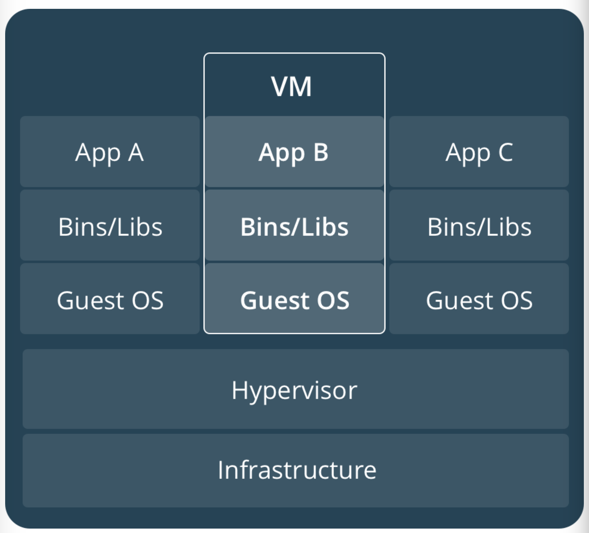
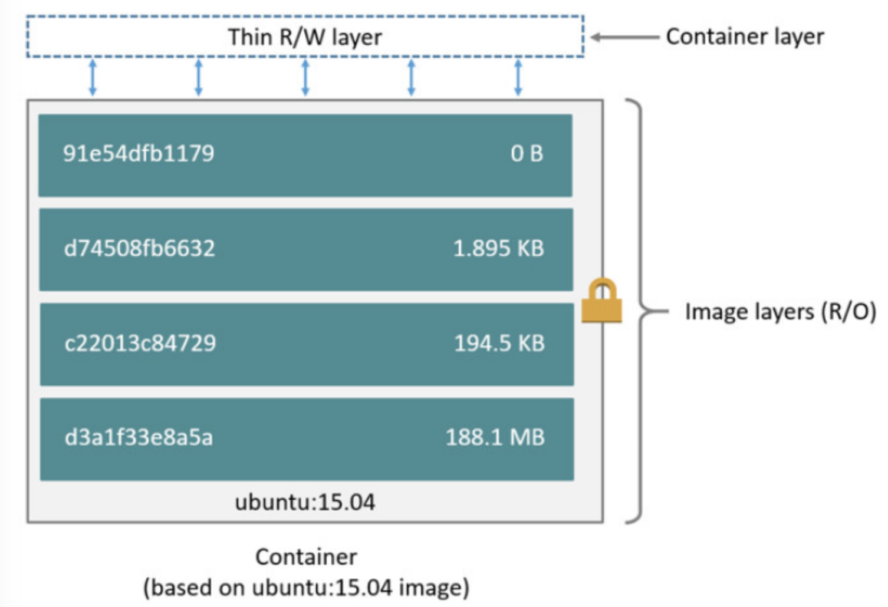
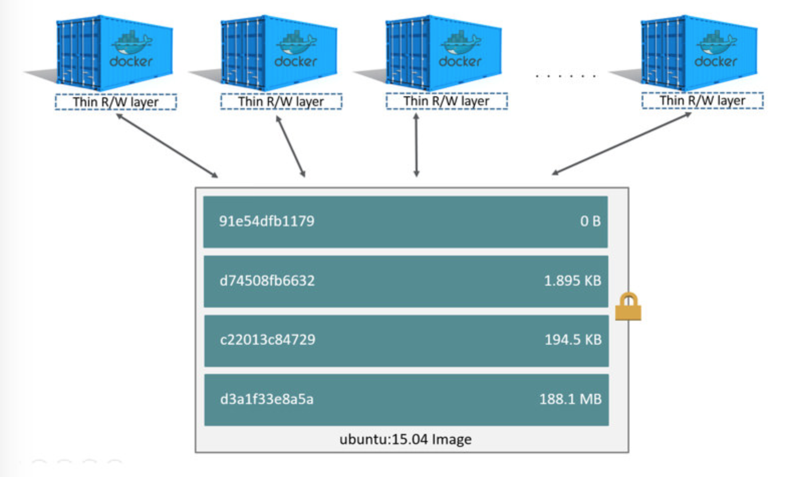

Docker는 Application의 배포와 운영을 쉽게 도와주는 'containers as a Service Platform'이며 Client-Server Model로 동작한다. 여기서 **container** 란, 운영체제의 커널이 하나의 인스턴스가 아닌 여러 개의 격리된 인스턴스들을 갖출 수 있도록 하는 서버 **가상화** 방식이다. 이러한 인스턴스 들은 이를 소유하고 있는 Host Machine과 사용자의 관점에서 바라보면, 실제 서버인 것처럼 보인다.

### 가상화

Container는 가상화 방식의 한 종류이다. 하지만 흔히 우리가 알고있는 가상(Virtualization)은 VM Ware Workstation과 같은 소프트웨어를 이용해, Linux나 MacOS위에 Windows를 올려 사용하는 것을 떠올릴텐데 이러한 방식들이 하드웨어와 소프트웨어를 결합하여 VM을 만들어 사용하는 Platform 가상화를 의미한다. Platform 가상화는 주어진 하드웨어 Platform 위에서 제어프로그램, 즉 Host 소프트웨어를 통해 실행된다. Host 소프트웨어는 Host 환경 내의 Guest 소프트웨어에 맞춰 VM을 만들어 낸다. Guest소프트웨어는 완전한 운영체제이며, 독립된 하드웨어 Platform에 설치된 것처럼 실행된다.

### VM의 전가상화

VM은 하나의 서버를 여러 서버로 전환시키는 물리적 하드웨어의 추상화로 **Hypervior 기반의 시스템 가상화 이다.** hypervisor는 기반이 되는 시스템 안에 또 다른 시스템을 구동 시킬 수 있게 시스템의 각 요소들을 가상화 해서 제공한다. 이 때 기반 시스템을 보통 Host 시스템이라 하고 Hypervisor위에 돌아가는 시스템을 가상 시스템이라 한다. Hypervisor는 Host 시스템의 자원을 기반으로 가상 시스템이 독립적으로 움직일 수 있도록 한다. 따라서 Hypervisor를 사용하여 여러 대의 VM을 단일 시스템에서 실행할 수 있지만, 호스트 시스템의 하드웨어 자원에 제한을 받는다.

[출처 : Docker Docs](https://docs.docker.com/get-started/#images-and-containers)

### Container의 반가상화

반면 Container는 공유된 운영체제에서 격리되어 실행할 수 있는 형식으로 소프트웨어를 가상화하는 방법이다. Hypervisor처럼 시스템의 전반적인 것을 가상화하는 것이 아닌 Application을 구동할 수 있는 환경 즉, CPU와 Memory영역 등을 가상화하고 구동하는데 필요한 운영체제나 라이브러리는 호스트시스템과 공용으로 사용한다.

[출처 : Docker Docs](https://docs.docker.com/get-started/#images-and-containers)

### VM vs Container

VM은 CPU, 메모리, 디스크는 물론이고 그 안에서 구동중인 운영체제와 각종 라이브러리 까지 전체 영역을 독립적으로 구분되어 운영된다. 따라서, 각 VM에는 운영체제의 전체 번들, 하나 이상의 응용 프로그램, 필요한 바이너리 및 라이브러리 전체가 포함되어 있기 때문에 수십 GB를 차지함.

반면, Container는 전체 운영 체제를 번들로 제공하지 않는다. 단지, 소프트웨어가 실행할 때 필요한 라이브러리 및 설정들만 포함되기 때문에 VM보다 적은 공간을 차지한다. 일반적으로 Container를 생성하는 Image의 크기는 수십 MB정도이다. 따라서, **Container는 VM보다 공간을 효율적으로 사용할 수 있고, 가볍다.**

### Container의 한계

하지만 Container에도 한계점은 존재한다. 기존 Hypervisor기반의 가상화 기술보다 Container가 뒤어난 부분은 앞서 애기한 것처럼 속도가 빠르고 자원 소비율이 적기 때문에, 같은 자원을 갖고 있는 Host 시스템에서 더 많은 Application을 가상화 기반 위에 동작시킬 수 있다. 하지만 Docker의 기반이 되는 Container 기술은 Application의 구동 환경을 가상화 하기 때문에 호스트 시스템에서 제공하는 운영체제와 같은 환경에서만 제공한다는 단점이 있다. 즉 일반 Docker 환경(linux)이서 Windows Application 실행은 현재로선 어렵단 것이다.

### Container

지금까지는 container가 어떤 것인지 대해 살펴봤는데 이제 어떻게 생성되고 동작하는지에 대해 알아보자.

#### Image와 Container의 layer

먼저 Container에 대해서 살펴보기 전에, Container 실행의 주체가 되는 Image에 대해 알아보자.

#### image와 layer

Image는 Dockerfile이라는 Build 명세서를 바탕으로 생성된다. 이래는 16.04 version ubuntu image의 Dockerfile이다. [Github: docker-brew-ubuntu-core/xenial/Dockerfile](https://github.com/tianon/docker-brew-ubuntu-core/blob/5fce3945d95630c2fc03c21ef8665d92bd824642/xenial/Dockerfile)

~~~
FROM scratch
ADD ubuntu-xenial-core-cloudimg-amd64-root.tar.gz /

# a few minor docker-specific tweaks
# see https://github.com/docker/docker/blob/9a9fc01af8fb5d98b8eec0740716226fadb3735c/contrib/mkimage/debootstrap
RUN set -xe \

    ... 중략 ...

# delete all the apt list files since they're big and get stale quickly
RUN rm -rf /var/lib/apt/lists/*
# this forces "apt-get update" in dependent images, which is also good

# enable the universe
RUN sed -i 's/^#\s*\(deb.*universe\)$/\1/g' /etc/apt/sources.list

# make systemd-detect-virt return "docker"
# See: https://github.com/systemd/systemd/blob/aa0c34279ee40bce2f9681b496922dedbadfca19/src/basic/virt.c#L434
RUN mkdir -p /run/systemd && echo 'docker' > /run/systemd/container

# overwrite this with 'CMD []' in a dependent Dockerfile
CMD ["/bin/bash"]
~~~

ubuntu의 Dockerfile은 다음의 명령어들로 구성되어 있다.

* From
* ADD
* 4개의 RUN
* CMD

Dockerfile로 부터 Image가 구성될 때, Dockerfile의 각각의 명령어가 Layer로 구성된다. 만약 `docker build [OPTIONS] PATH | URL | -`을 사용하여 위의 Dockerfile로부터 Ubuntu를 Image로 Build하려 할 때 From을 제외한 6개의 명령어가 각각의 Layer로 구성된다.

Image의 Layer가 실제로 Dockerfile의 명령어로 이루어져 있는지 `docker history [OPTIONS] IMAGE`를 사용하여 확인해보자.

~~~
{18-07-05 15:42}jaejin-ui-MacBook-Pro:~/dev/Docker@master jaejin% docker images
REPOSITORY                     TAG                 IMAGE ID            CREATED             SIZE
redis                          latest              71a81cb279e3        8 days ago          83.4MB
mysql                          5.7                 66bc0f66b7af        8 days ago          372MB
ubuntu                         16.04               5e8b97a2a082        4 weeks ago         114MB
ubuntu                         latest              113a43faa138        4 weeks ago         81.2MB
hello-world                    latest              e38bc07ac18e        2 months ago        1.85kB
hyperledger/fabric-baseimage   x86_64-0.2.2        4ac07a26ca7a        19 months ago       1.24GB
teamlab/pydata-tensorflow      0.1                 7bdf5d7e0191        23 months ago       3.08GB
{18-07-05 16:03}jaejin-ui-MacBook-Pro:~/dev/Docker@master✗✗✗✗✗✗ jaejin% docker history 113a43faa138
IMAGE               CREATED             CREATED BY                                      SIZE                COMMENT
113a43faa138        4 weeks ago         /bin/sh -c #(nop)  CMD ["/bin/bash"]            0B
<missing>           4 weeks ago         /bin/sh -c mkdir -p /run/systemd && echo 'do…   7B
<missing>           4 weeks ago         /bin/sh -c sed -i 's/^#\s*\(deb.*universe\)$…   2.76kB
<missing>           4 weeks ago         /bin/sh -c rm -rf /var/lib/apt/lists/*          0B
<missing>           4 weeks ago         /bin/sh -c set -xe   && echo '#!/bin/sh' > /…   745B
<missing>           4 weeks ago         /bin/sh -c #(nop) ADD file:28c0771e44ff530db…   81.1MB
~~~

총 6개의 행을 확인 할 수 있으면, CREATED BY열에서 해당 Layer가 어떤 명령어로 생성되었는지 확인 할 수 있다. 이렇게 생성된 Layer를 Image Layer라 하며, Image Layer는 수정이 불가능하며, 오로지 읽기만 가능하다.

### Container와 Image

오로지 읽기만 가능한, Image Layer의 최상단에 읽기/쓰기가 가능한 얇은 Layer가 추가되어 실행할 수 있는데, 이것이 바로 Container이다. 새로 추가된 Layer는 Container Layer라 한다. Container Layer에는 Container 기동 중 발생하는 모든 변경 사항들(파일 생성, 수정, 삭제 등)이 작성되고 저장된다. 아래는 현재 Local Repository에 실제로 저장된 Ubuntu의 image Layer이다.

~~~
/ # ls /var/lib/docker/overlay2/
14ed0fd37eebdc612b798270d3685a6a6c1a6c42dde696aa4048533dfe1a86fe
21535fcab696330a4d6de5bed2a06e65f8547ca6d3cdaacf6dd636f41a4d27cf
8803ef05c1bd6845eade31d9aba92f538700971e630cf274b3ccd11dc6a8a304
fc25a819ae26279427b3203b1acd4309cb622de19479fe1ce5890635c0052740
fc83da02f8a1ec7f9cc40e512aafe550dd1030883ddc82c56e59d229dcda60f2
l
~~~

Ubuntu image로 부터 Container를 기동하자.

~~~
$ docker run -dit --name ubuntu-local ubuntu /bin/bash
8c0ee2a29f48b2e9ac27ed26f87aa4f32705dd52e3bea228528e6d9fce210e76

$ docker ps -s
CONTAINER ID        IMAGE               COMMAND             CREATED                  STATUS              PORTS               NAMES               SIZE
8c0ee2a29f48        ubuntu              "/bin/bash"         Less than a second
~~~

아래와 같이 Docker Machine에 직접 접속하면 Container가 기동되면서 Container Layer가 추가 된 것을 확인할 수 있다.

~~~
/ # ls /var/lib/docker/overlay2/
14ed0fd37eebdc612b798270d3685a6a6c1a6c42dde696aa4048533dfe1a86fe
21535fcab696330a4d6de5bed2a06e65f8547ca6d3cdaacf6dd636f41a4d27cf
8803ef05c1bd6845eade31d9aba92f538700971e630cf274b3ccd11dc6a8a304
+ c7a75746f5f12bcbb5ae03c20a65f080b2e7c9f1ec897491309ac3843454cff8
+ c7a75746f5f12bcbb5ae03c20a65f080b2e7c9f1ec897491309ac3843454cff8-init
fc25a819ae26279427b3203b1acd4309cb622de19479fe1ce5890635c0052740
fc83da02f8a1ec7f9cc40e512aafe550dd1030883ddc82c56e59d229dcda60f2
l
~~~

기동 중인 Container를 삭제

~~~
{18-07-05 16:08}jaejin-ui-MacBook-Pro:~/dev/Docker@master✗✗✗✗✗✗ jaejin% docker stop ubuntu-local
ubuntu-local
{18-07-05 16:10}jaejin-ui-MacBook-Pro:~/dev/Docker@master✗✗✗✗✗✗ jaejin% docker rm ubuntu-local
ubuntu-local
{18-07-05 16:10}jaejin-ui-MacBook-Pro:~/dev/Docker@master✗✗✗✗✗✗ jaejin% docker ps -s
CONTAINER ID        IMAGE               COMMAND             CREATED             STATUS              PORTS               NAMES               SIZE
~~~

이전에 생성되었던 Container Layer는 삭제되었고 Image Layer만 남아있는 것을 알 수 있다.

~~~
/ # ls /var/lib/docker/overlay2/
14ed0fd37eebdc612b798270d3685a6a6c1a6c42dde696aa4048533dfe1a86fe
21535fcab696330a4d6de5bed2a06e65f8547ca6d3cdaacf6dd636f41a4d27cf
8803ef05c1bd6845eade31d9aba92f538700971e630cf274b3ccd11dc6a8a304
fc25a819ae26279427b3203b1acd4309cb622de19479fe1ce5890635c0052740
fc83da02f8a1ec7f9cc40e512aafe550dd1030883ddc82c56e59d229dcda60f2
l
~~~

정리하면, 다음과 같다.

* Image는 Layer의 Set으로 이루어져 있으며, 각가의 Layer는 dockerfile의 명령어에 해단한다.
* Image Layer는 읽기전용 Layer로 수정할 수 없다.
* Container를 기동하면, 읽기/쓰기가 가능한 Container Layer가 Image Layer Set의 최상단에 추가된다.
* Container 기동 중 발생한 모든 행위는 Container Layer에 기록되며, Container가 삭제되면 해당 Container Layer도 삭제된다.(단, Image Layer는 삭제되지 않음.)

아래는 Image와 Container Layer를 도식화한 것이다.

[출처 : Docker Docs](https://docs.docker.com/storage/storagedriver/#images-and-layers)

### Layer의 공유

하나의 Image로 부터 여러개의 Container가 기동될 때는 어떻게 되는지 보자. 먼저 Ubuntu Image로 부터 **ubuntu-local-NUM** 이름의 Countainer들을 기동시킨다.

~~~
{18-07-05 16:16}jaejin-ui-MacBook-Pro:~/dev/Docker@master✗✗✗✗✗✗ jaejin% docker run -dit --name ubuntu-local-1 ubuntu /bin/bash && docker run -dit --name ubuntu-local-2 ubuntu /bin/bash && docker run -dit --name ubuntu-local-3 ubuntu /bin/bash
a6f937d4f93bc8cf62af106ac226d8af02f8cfb79241207e7cb5e070a10cd94a
cec473a08e650889e7960b3b9ae70b2108bdeea791dbbb4adf441b4a6b693367
e86d7bb877572f61ba817587dec153bffe6baf131a85d6af842b150d67d9f378
{18-07-05 16:17}jaejin-ui-MacBook-Pro:~/dev/Docker@master✗✗✗✗✗✗ jaejin% docker ps
CONTAINER ID        IMAGE               COMMAND             CREATED                  STATUS              PORTS               NAMES
e86d7bb87757        ubuntu              "/bin/bash"         Less than a second ago   Up 1 second                             ubuntu-local-3
cec473a08e65        ubuntu              "/bin/bash"         Less than a second ago   Up 2 seconds                            ubuntu-local-2
a6f937d4f93b        ubuntu              "/bin/bash"         Less than a second ago   Up 2 seconds                            ubuntu-local-1
~~~

Local Docker에 실제로 저장된 Container와 layer이다. 각 Container 별 Container Layer가 추가 되었으나, Image Layer는 추가 되지 않았다.

~~~
/ # ls /var/lib/docker/overlay2/
14ed0fd37eebdc612b798270d3685a6a6c1a6c42dde696aa4048533dfe1a86fe
+ 15123a9c6da09e3ac10a96846059a7af7bdfc040d7895eae40f22df12c8f3e5a
+ 15123a9c6da09e3ac10a96846059a7af7bdfc040d7895eae40f22df12c8f3e5a-init
21535fcab696330a4d6de5bed2a06e65f8547ca6d3cdaacf6dd636f41a4d27cf
+ 2de0c7fc0c717cb2b834b33857d369b92599bfd53078a16bfa7690af2200b727
+ 2de0c7fc0c717cb2b834b33857d369b92599bfd53078a16bfa7690af2200b727-init
8803ef05c1bd6845eade31d9aba92f538700971e630cf274b3ccd11dc6a8a304
+ ed0d6800996f0b1e0d7f0ae845128a89c9029aa6019dd3ea2efed965e4bee760
+ ed0d6800996f0b1e0d7f0ae845128a89c9029aa6019dd3ea2efed965e4bee760-init
fc25a819ae26279427b3203b1acd4309cb622de19479fe1ce5890635c0052740
fc83da02f8a1ec7f9cc40e512aafe550dd1030883ddc82c56e59d229dcda60f2
~~~

기동 중인 Container의 대략적인 크기는 `docker ps -s`로 확인할 수 있다.

~~~
{18-07-05 16:19}jaejin-ui-MacBook-Pro:~/dev/Docker@master✗✗✗✗✗✗ jaejin% docker ps -s
CONTAINER ID        IMAGE               COMMAND             CREATED             STATUS              PORTS               NAMES               SIZE
e86d7bb87757        ubuntu              "/bin/bash"         2 minutes ago       Up 2 minutes                            ubuntu-local-3      0B (virtual 81.2MB)
cec473a08e65        ubuntu              "/bin/bash"         2 minutes ago       Up 2 minutes                            ubuntu-local-2      0B (virtual 81.2MB)
a6f937d4f93b        ubuntu              "/bin/bash"         2 minutes ago       Up 2 minutes                            ubuntu-local-1      0B (virtual 81.2MB)
~~~

* **size** : 각 Container의 Container Layer에서 사용하고 있는 Data양
* **virtual size** : Image Layer에서 사용하고 있는 Data양

Local Docker의 File System에 저장된 실제 Container 크기

~~~
/ # du -sh /var/lib/docker/containers/*
32.0K   /var/lib/docker/containers/87fccd76cd1d195bc25dd0e30203c3d3f056bb69a2851a1feef8026386ccb440
32.0K   /var/lib/docker/containers/cc2f62db98b4ed5aadc6904229db1c1f2f58d69f3ef4c120eb78402a12a96f7d
32.0K   /var/lib/docker/containers/f921b84e42d42bdad629f58398ac18d942c25c3451238a361f841b0b8d630523
~~~

지금까지 과정에서 2가지 사실을 확인 할 수 있다.

* 같은 Image를 바탕으로 Container가 기동될 때, Container Layer만 추가된다.
* 대략적으로 보이는 Container의 크기와 실제 저장된 크기는 차이가 있다. (docker ps -s로 나타난 각 Container의 크기는 122MB로 보이지만 실제 File System에 저장된 Container는 32.0K이다.)

동일한 Image를 바탕으로 기동된 Container는 각각의 Container Layer만 추가되며, Image Layer는 공유하여 사용한다는 사실을 알 수 있다. 또한 Container는 개별적으로 Container Layer를 갖고 해당 Layer에 모든 변경된 내용이 저장되기 때문에, 여러 Container가 동일한 기본 Image를 공유하여 사용하면서 Container 자신의 Data 상태를 가질 수 있다. 이러한 특성으로 인해, Docker Container는 더욱 가벼워지고 기동 속도가 빨라질 수 있는 것이다.

[출처 : Docker Docs](https://docs.docker.com/storage/storagedriver/#images-and-layers)

Ubuntu Image를 통해, Image와 Container의 Layer 구조를 확인함으로써 Docker가 왜 가볍고 빠른지 알 수 있엇다.
