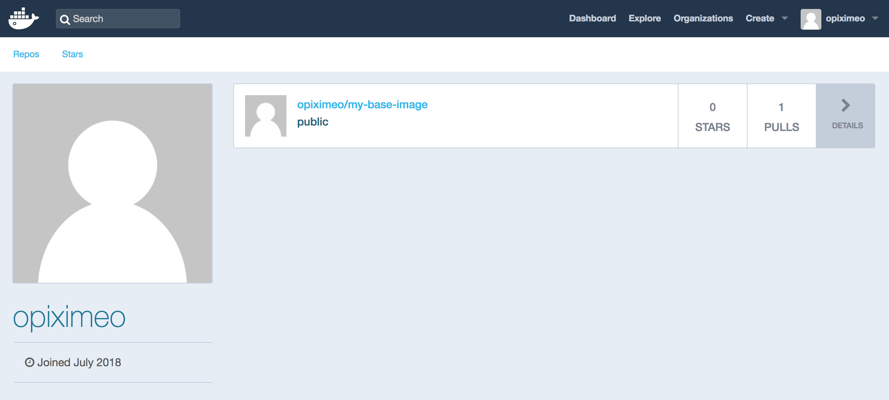

### Dockerfile 작성

**image-build-test** 폴더를 생성한 뒤 다음의 내용이 포함된 **Dockerfile** 을 생성한다.

~~~
FROM ubuntu:16.10
COPY . /app
~~~

**image-build-test** 폴더의 내부 구조는 다음과 같다.

~~~
/image-build-test $ tree
.
└── Dockerfile

0 directories, 1 file
~~~

### Image Build

**image-build-test** 폴더 내에서 생성한 Dockerfile로 `${username}/my-base-image:1.0` 이란 이름의 Image를 Build 한다.

~~~
{18-07-05 16:46}jaejin-ui-MacBook-Pro:~/dev/Docker/image-build-test@master✗✗✗✗✗✗ jaejin% docker build -t opiximeo/my-base-image:1.0 -f Dockerfile .
Sending build context to Docker daemon  3.584kB
Step 1/2 : FROM ubuntu:16.10
16.10: Pulling from library/ubuntu
dca7be20e546: Pull complete
40bca54f5968: Pull complete
61464f23390e: Pull complete
d99f0bcd5dc8: Pull complete
120db6f90955: Pull complete
Digest: sha256:8dc9652808dc091400d7d5983949043a9f9c7132b15c14814275d25f94bca18a
Status: Downloaded newer image for ubuntu:16.10
 ---> 7d3f705d307c
Step 2/2 : COPY . /app
 ---> a22f533cdf49
Successfully built a22f533cdf49
Successfully tagged opiximeo/my-base-image:1.0
~~~

처음 Image를 Build하게 되면, Local Instance에 저장된 Base Image(여기서는 Ubuntu Image)가 존재하지 않기 때문에 Docker Registry(Docker Hub)로 부터 Pull을 받는다. 그 후, Dockerfile의 **COPY** 명령어가 새로운 Layer로 생성되고, `${username}/my-base-image:1.0` Image가 Build된다.

생성된 Image를 확인해보자.

~~~
{18-07-05 16:49}jaejin-ui-MacBook-Pro:~/dev/Docker/image-build-test@master✗✗✗✗✗✗ jaejin% docker images
REPOSITORY                     TAG                 IMAGE ID            CREATED              SIZE
opiximeo/my-base-image         1.0                 a22f533cdf49        About a minute ago   107MB
~~~

### Container를 Run

방금 생성한 Image를 Local에서 실행시켜 보자. 정상적으로 실행되면 **Container ID** 가 나타나고 `docker ps`로 실행중인 해당 Container를 목록에서 확인할 수 있다.

~~~
{18-07-05 16:51}jaejin-ui-MacBook-Pro:~/dev/Docker/image-build-test@master✗✗✗✗✗✗ jaejin% docker run -dit --name opiximeo_container opiximeo/my-base-image:1.0 bash
c43c1c2d6047b51f5e3292fd249e2ed325b0584f0f475dccc870631601ca2f06
{18-07-05 16:53}jaejin-ui-MacBook-Pro:~/dev/Docker/image-build-test@master✗✗✗✗✗✗ jaejin% docker ps -s
CONTAINER ID        IMAGE                        COMMAND             CREATED             STATUS              PORTS               NAMES                SIZE
c43c1c2d6047        opiximeo/my-base-image:1.0   "bash"              3 seconds ago       Up 10 seconds                           opiximeo_container   0B (virtual 107MB)
~~~

### Image를 Docker Hub에 배포

이제는 생성한 Image를 Docker Registry에 배포해 보자. 따로 Docker Registry를 구성하지 않았기 때문에 배포되는 장소는 Docker Hub이며, 정상적으로 배포하기 위해서 먼저 Login을 하자.

~~~
{18-07-05 16:53}jaejin-ui-MacBook-Pro:~/dev/Docker/image-build-test@master✗✗✗✗✗✗ jaejin% docker login
Login with your Docker ID to push and pull images from Docker Hub. If you don't have a Docker ID, head over to https://hub.docker.com to create one.
Username: opiximeo
Password:
Login Succeeded
~~~

로그인이 정상적으로 되었다면 `docker push`로 생성한 Image를 Docker Registry에 등록.

~~~
{18-07-05 16:54}jaejin-ui-MacBook-Pro:~/dev/Docker/image-build-test@master✗✗✗✗✗✗ jaejin% docker push opiximeo/my-base-image:1.0
The push refers to repository [docker.io/opiximeo/my-base-image]
8ec11dbda0ff: Pushed
fcc11235a441: Mounted from library/ubuntu
0ba4c05a8843: Mounted from library/ubuntu
47a3ebbaa644: Mounted from library/ubuntu
31eed92f5a23: Mounted from library/ubuntu
57145c01eb80: Mounted from library/ubuntu
1.0: digest: sha256:241f3cecd9c69243f25875207f9d0e94ea18f99b703a2f32c4b8a65c95ba9d2f size: 1564
~~~

console에 찍힌 로그를 보면 Ubuntu Image는 이미 Docker Registry에 존재하기 때문에 Mount만 되고 그 외에 생성한 Layer만 추가로 Push되는 것을 볼 수 있다.

이렇게 생성된 것을 확인할 수 있다.

### Hello World를 만들어 보자.

처음에 `hello-world`를 실행시켜 봤었다.

#### Dockerfile 변경

생성된 Dockerfile을 **Dockerfile.base** 로 변경 한 후, `${username}/my-base-image:1.0` Image에 `CMD` Layer가 추가된 Image를 생성하는 **Dockerfile** 을 새로 생성한다.

~~~
FROM ${username}/my-base-image:1.0
CMD /app/hello.sh
~~~

다음과 같은 내용으로 hello.sh를 생성

~~~
#!/bin/sh
echo "Hello world"
~~~

**hello.sh** 파일을 저장하고 실행가능한 상태로 변경한다.

~~~
/image-build-test $ chmod +x hello.sh
~~~

변경된 폴더 구조는 다음과 같다.

~~~
/image-build-test $ tree
.
├── Dockerfile
├── Dockerfile.base
└── hello.sh

0 directories, 3 files
~~~

### hello World Image Build

변경된 Dockerfile로 `${username}/my-final-image:1.0` 이란 이름의 Image를 Build한다.

~~~
{18-07-05 17:02}jaejin-ui-MacBook-Pro:~/dev/Docker/image-build-test@master✗✗✗✗✗✗ jaejin% docker build -t opiximeo/my-final-image:1.0 -f Dockerfile .
Sending build context to Docker daemon  7.168kB
Step 1/2 : FROM opiximeo/my-base-image:1.0
 ---> a22f533cdf49
Step 2/2 : CMD /app/hello.sh
 ---> Running in 7111416b1ad8
Removing intermediate container 7111416b1ad8
 ---> 59d5cfd02d79
Successfully built 59d5cfd02d79
Successfully tagged opiximeo/my-final-image:1.0
~~~

처음에 Build 했을때 보다 월등히 빠르게 Build 되는 것을 알 수 있다. `${username}/my-final-image:1.0` 의 Base Image가 이미 Local에 존재하기 때문에 `CMD` 에 해당하는 Layer만 생성하면 되기 때문이다.

생성된 Image를 확인한다.

~~~
{18-07-05 17:04}jaejin-ui-MacBook-Pro:~/dev/Docker/image-build-test@master✗✗✗✗✗✗ jaejin% docker images
REPOSITORY                     TAG                 IMAGE ID            CREATED             SIZE
opiximeo/my-final-image        1.0                 59d5cfd02d79        49 seconds ago      107MB
opiximeo/my-base-image         1.0                 a22f533cdf49        16 minutes ago      107MB
~~~

`docker history [OPTIONS] IMAGE`로 각 Image를 구성하는 Layer를 한번 확인해 보겠다. 두 Image 사이에서 공유하는 layer는 암호화된 ID가 동일하다는 것을 확인 할 수 있다.

~~~
{18-07-05 17:05}jaejin-ui-MacBook-Pro:~/dev/Docker/image-build-test@master✗✗✗✗✗✗ jaejin% docker history opiximeo/my-base-image:1.0
IMAGE               CREATED             CREATED BY                                      SIZE                COMMENT
a22f533cdf49        17 minutes ago      /bin/sh -c #(nop) COPY dir:03d1127f3732d2178…   553B
7d3f705d307c        11 months ago       /bin/sh -c #(nop)  CMD ["/bin/bash"]            0B
<missing>           11 months ago       /bin/sh -c mkdir -p /run/systemd && echo 'do…   7B
<missing>           11 months ago       /bin/sh -c sed -i 's/^#\s*\(deb.*universe\)$…   2.78kB
<missing>           11 months ago       /bin/sh -c rm -rf /var/lib/apt/lists/*          0B
<missing>           11 months ago       /bin/sh -c set -xe   && echo '#!/bin/sh' > /…   745B
<missing>           11 months ago       /bin/sh -c #(nop) ADD file:6cd9e0a52cd152000…   107MB

{18-07-05 17:06}jaejin-ui-MacBook-Pro:~/dev/Docker/image-build-test@master✗✗✗✗✗✗ jaejin% docker history opiximeo/my-final-image:1.0
IMAGE               CREATED             CREATED BY                                      SIZE                COMMENT
59d5cfd02d79        2 minutes ago       /bin/sh -c #(nop)  CMD ["/bin/sh" "-c" "/app…   0B
a22f533cdf49        17 minutes ago      /bin/sh -c #(nop) COPY dir:03d1127f3732d2178…   553B
7d3f705d307c        11 months ago       /bin/sh -c #(nop)  CMD ["/bin/bash"]            0B
<missing>           11 months ago       /bin/sh -c mkdir -p /run/systemd && echo 'do…   7B
<missing>           11 months ago       /bin/sh -c sed -i 's/^#\s*\(deb.*universe\)$…   2.78kB
<missing>           11 months ago       /bin/sh -c rm -rf /var/lib/apt/lists/*          0B
<missing>           11 months ago       /bin/sh -c set -xe   && echo '#!/bin/sh' > /…   745B
<missing>           11 months ago       /bin/sh -c #(nop) ADD file:6cd9e0a52cd152000…   107MB
~~~

### 다시 Push

`${username}/my-final-image:1.0` Image를 Docker Registry에 Push한다. Docker Registry에는 ${username}/my-base-image:1.0 Image의 Layer들이 이미 존재하고 있기 때문에 추가된 Layer(Dockerfile에 추가된 `CMD`)만 Push 된다.

~~~
{18-07-05 17:06}jaejin-ui-MacBook-Pro:~/dev/Docker/image-build-test@master✗✗✗✗✗✗ jaejin% docker push opiximeo/my-final-image:1.0
The push refers to repository [docker.io/opiximeo/my-final-image]
8ec11dbda0ff: Mounted from opiximeo/my-base-image
fcc11235a441: Mounted from opiximeo/my-base-image
0ba4c05a8843: Mounted from opiximeo/my-base-image
47a3ebbaa644: Mounted from opiximeo/my-base-image
31eed92f5a23: Mounted from opiximeo/my-base-image
57145c01eb80: Mounted from opiximeo/my-base-image
1.0: digest: sha256:9eb3217812533540ffffb8325c3cea2af8cfc945c4da78d35759b1c3a80f7320 size: 1564
~~~

### 다른 곳에서 Hello World를 실행해보자

새로운 환경에서 지금 만든 Image를 Container로 실행시켜보자. 그전에 `docker-machine create` 로 새로운 Docker 환경을 구성한다.

~~~
{18-07-05 18:06}jaejin-ui-MacBook-Pro:~/dev/Docker@master✗✗✗✗✗✗ jaejin% docker-machine create opiximeo
Running pre-create checks...
(opiximeo) No default Boot2Docker ISO found locally, downloading the latest release...
(opiximeo) Latest release for github.com/boot2docker/boot2docker is v18.05.0-ce
(opiximeo) Downloading /Users/jaejin/.docker/machine/cache/boot2docker.iso from https://github.com/boot2docker/boot2docker/releases/download/v18.05.0-ce/boot2docker.iso...
cd /users/jaejin
ls
dasasls
(opiximeo) 0%....10%....20%....30%....40%....50%....60%....70%....80%....90%....100%
Creating machine...
(opiximeo) Copying /Users/jaejin/.docker/machine/cache/boot2docker.iso to /Users/jaejin/.docker/machine/machines/opiximeo/boot2docker.iso...
(opiximeo) Creating VirtualBox VM...
(opiximeo) Creating SSH key...
(opiximeo) Starting the VM...
(opiximeo) Check network to re-create if needed...
(opiximeo) Found a new host-only adapter: "vboxnet0"
(opiximeo) Waiting for an IP...
Waiting for machine to be running, this may take a few minutes...
Detecting operating system of created instance...
Waiting for SSH to be available...
Detecting the provisioner...
Provisioning with boot2docker...
Copying certs to the local machine directory...
Copying certs to the remote machine...
Setting Docker configuration on the remote daemon...
Checking connection to Docker...
Docker is up and running!
To see how to connect your Docker Client to the Docker Engine running on this virtual machine, run: docker-machine env opiximeo
~~~

새로 구성한 Docker 환경에 `docker-machine ssh`로 접속한다.

~~~
{18-07-05 18:19}jaejin-ui-MacBook-Pro:~ jaejin% docker-machine ssh opiximeo
                        ##         .
                  ## ## ##        ==
               ## ## ## ## ##    ===
           /"""""""""""""""""\___/ ===
      ~~~ {~~ ~~~~ ~~~ ~~~~ ~~~ ~ /  ===- ~~~
           \______ o           __/
             \    \         __/
              \____\_______/
 _                 _   ____     _            _
| |__   ___   ___ | |_|___ \ __| | ___   ___| | _____ _ __
| '_ \ / _ \ / _ \| __| __) / _` |/ _ \ / __| |/ / _ \ '__|
| |_) | (_) | (_) | |_ / __/ (_| | (_) | (__|   <  __/ |
|_.__/ \___/ \___/ \__|_____\__,_|\___/ \___|_|\_\___|_|
Boot2Docker version 18.05.0-ce, build HEAD : b5d6989 - Thu May 10 16:35:28 UTC 2018
Docker version 18.05.0-ce, build f150324
docker@opiximeo:~$
~~~

지금 만든 Image를 Pull 받는다.

~~~
docker@opiximeo:~$ docker pull opiximeo/my-final-image:1.0
1.0: Pulling from opiximeo/my-final-image
dca7be20e546: Pull complete
40bca54f5968: Pull complete
61464f23390e: Pull complete
d99f0bcd5dc8: Pull complete
120db6f90955: Pull complete
7b9b702b8428: Pull complete
Digest: sha256:9eb3217812533540ffffb8325c3cea2af8cfc945c4da78d35759b1c3a80f7320
Status: Downloaded newer image for opiximeo/my-final-image:1.0
~~~

새로 구성된 환경이라 Image의 모든 Layer들을 내려받는다. 그리고 `docker run`을 실행한다.

~~~
docker@opiximeo:~$ docker run opiximeo/my-final-image:1.
0
/bin/sh: 1: /app/hello.sh: not found
~~~

hello.sh가 실행되서 Hello world가 출력되야하지만 출력이 왜안되지...

아무튼 Build - Push - Pull - Run의 과정으로 Container가 실행되는 것을 확인 할 수 있었다. Docker Engine이 설치된 어떤 환경에서도 지금 만든 **Hello World** 는 실행될 것이다. 여기서 더해 다양한 Application을 만들수 잇을 것이다.

Container에 읽기/쓰기가 가능한 layer내에 변경된 내용들이 저장된다는 것을 알고 있다. 이 데이터들은 Container와 같이 소멸된다는 것도 알고 있다. 이때 Countainer가 소멸되었다가 새로 생성되어도 이전의 데이터들을 유지하여 사용할 방법은 없을까? 다음에는 Docker의 Volume을 이용해 데이터를 보존하는 방법을 알아보자.
